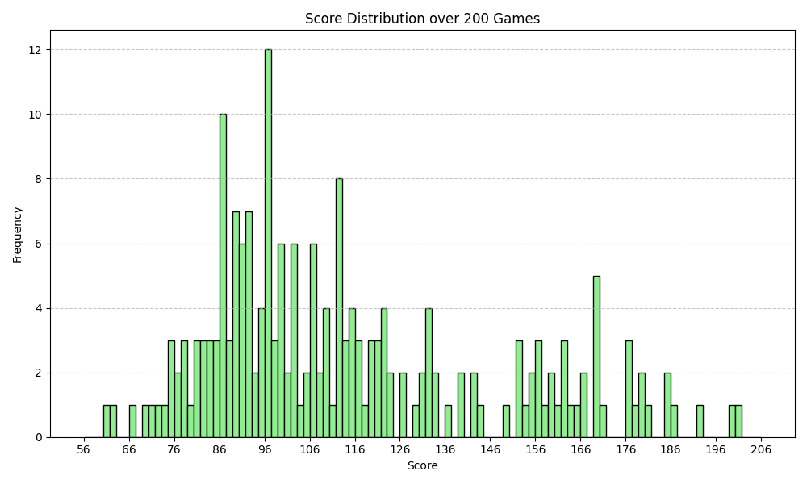
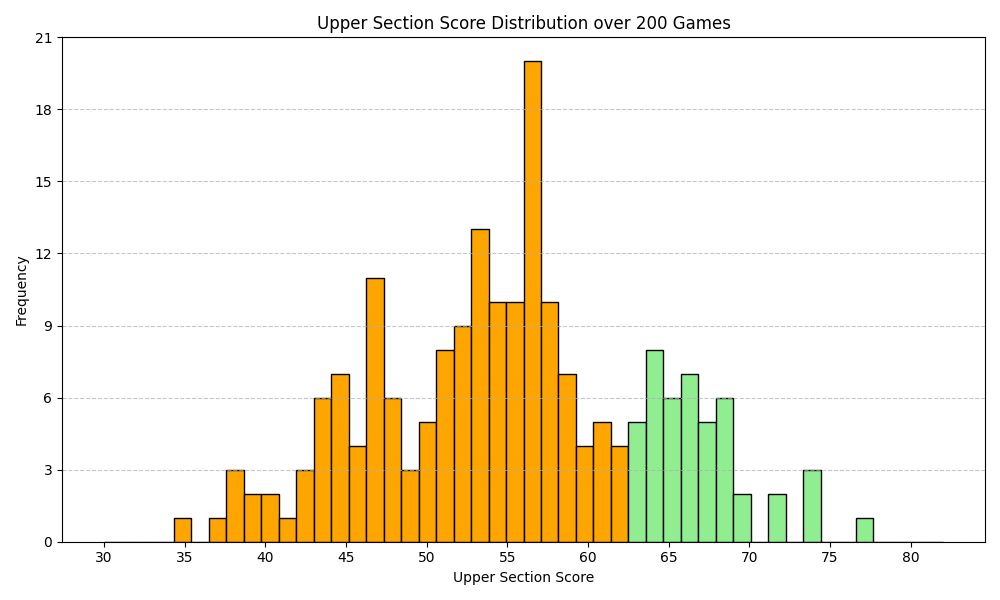

# Yahtzee Simulator

A configurable **Yahtzee game simulator** Python package for running automated games using custom strategies and getting visual statistics on the performance.


## Preview



## Overview
Automatically run thousands of Yahtzee games and test strategies by extending a simple `Strategy` template. The package provides detailed feedback on strategy performance, making it easy to analyze probabilities, decision-making logic, and optimize algorithms. Users can leverage this framework to develop strategies using techniques like Monte Carlo simulations or machine learning if they wish.

## Features
- Install the package using `pip` and import easily in Python
- Run any number of games efficiently
- Define custom strategies via `Strategy`
- Trace each decision made during the games
- Nordic style Yahtzee scoring and game rules
- Collect simulation statistics in JSON and generate plots per strategy and date

## What I Learned
- Designing clean and maintainable systems using Python OOP
- Implementing abstract classes, strategy, and enum design patterns
- Building maintainable and scalable simulation architectures
- Translating dice game into code that validates every move
- Creating a modern and usable Python package suitable for external use
- Calculating common statistics and plotting graphs from larger data sets

## Tech Stack
- Python 3.12
- Standard Library (`abc`, `random`, `dataclasses`, `unittest`)
- NumPy 1.26.4
- Matplotlib 3.10.7


## Requirements
- Python >= 3.12
- NumPy >= 1.26.4
- Matplotlib >= 3.10.7


## How to use the Python package
```bash
# 1.1) Install the package from my GitHub globally or in a virtual environment
pip install git+https://github.com/Puffen8/yahtzee-simulator.git@main

# 1.2) Or follow the 1) instruction in the "How to run the project" section and then pip installing
pip install -e .
```
```python
# 2) import it in a Python file and use it
from yahtzee_simulator import *
from yahtzee_simulator.strategies import ExampleStrategy

if __name__ == "__main__":
    strategy = ExampleStrategy()
    simulator = Simulator(strategy, 200, trace_history=False)
    simulator.run()
    simulator.print_summary()

```
```python
# 3) If you want you can create your own strategy by extending the Strategy abstract class
from yahtzee_simulator import *

class MyStrategy(Strategy):
    def should_finish_turn(self, dice: Dice, rolls_left: int, scorecard: Scorecard) -> bool:
        return rolls_left == 3

    def choose_dice_to_keep(self, dice: Dice, rolls_left: int, scorecard: Scorecard) -> tuple[int]:
        dice_to_keep = tuple()
        return dice

    def choose_category(self, dice: Dice, scorecard: Scorecard) -> Category:
        possible = scorecard.get_available_categories_with_scores(dice)
        if possible:
            return max(possible, key=possible.get)
        else:
            return get_least_worth_category_left(scorecard.available_categories())

if __name__ == "__main__":
    strategy = MyStrategy()
    simulator = Simulator(strategy, 200, trace_history=False)
    simulator.run()
    simulator.print_summary()
```

## How to run the project
```bash
# 1) Clone the repository
git clone git@github.com:Puffen8/yahtzee-simulator.git
cd yahtzee-simulator

# 2) Run the main
python main.py
```

## Running Tests
```bash
python -m unittest discover -s tests
```

